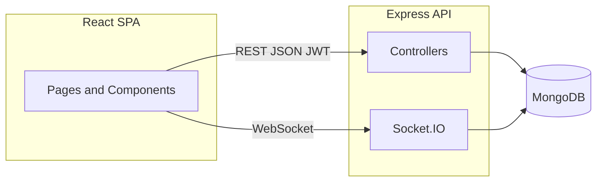

# PS Portal — Professional Skills & Campus Operations Web Platform

> **Note for report authors:** This README is structured as **source material** for a formal project report. Copy sections into Chapters I–V as needed. Replace bracketed placeholders (`[Your Name]`, `[Guide Name]`, etc.) before submission.

---

## 1. Basic project info

| Field | Details |
|--------|---------|
| **Project title** | PS Portal — Professional Skills Assessment & Campus Portal |
| **Institution / context** | BITSathy (as referenced in app branding and assets) — adaptable to any college deployment |
| **Domain** | **Web application** (full-stack): educational technology, assessment lifecycle, campus workflows |
| **Team members** | *[Fill in: Name 1, Roll/ID — Name 2, …]* |
| **Guide / mentor** | *[Optional — Fill in faculty name and designation]* |
| **Repository roots** | `psportal/frontend` (React SPA), `psportal/backend` (Node API) |

---

## 2. Problem statement

### What problem exists today?

- **Fragmented skill assessment:** Course delivery, question authoring, slot booking, invigilation-style rules, grading, and progress tracking often live in separate tools or spreadsheets, causing inconsistency and extra administrative work.
- **Manual coordination:** Faculty must share question banks via documents; admins manually align slots, venues, and approvals; students lack a single place to register, book, and attempt assessments.
- **Limited traceability:** Without a unified system, it is hard to audit who submitted what, when slots were booked, or how assessments were graded.
- **Campus operations overhead:** Beyond assessments, students and staff need digital access to leaves, attendance views, movement passes, bus tracking, and role-specific dashboards — many institutions still rely on paper or disjoint systems.

### Why current ad-hoc systems fail?

- **No single source of truth** for courses, levels, templates, bookings, and attempts.
- **Error-prone manual steps** (e.g. merging Excel question banks, manual slot lists).
- **Weak or inconsistent proctoring / attempt rules** when exams are conducted outside a dedicated platform.
- **Scalability:** Email and file exchange do not scale for hundreds of students and multiple concurrent assessments.

---

## 3. Objectives

The system aims to:

1. **Centralize** course structures, faculty assignments, assessment slots, and question banks in one web platform.
2. **Enable template-based authoring** so faculty can build MCQ, programming, match-pairs, and other layout-driven questions with a visual builder.
3. **Automate** student enrollment, slot booking, pre-test flows, and (where configured) automated grading using test cases and answer keys.
4. **Support role-based experiences** for students, technical faculty, mentors, wardens, security, bus incharge, admin, and super admin.
5. **Provide operational modules** for leaves, attendance, movement pass, coding practice, leaderboard, and live bus tracking (where enabled).
6. **Ensure secure access** via JWT and optional Google OAuth, with role-gated routes on both client and server.

---

## 4. Scope of the project

### Where it is used

- **Educational institution web environment:** Browsers on PC/laptop (responsive UI); intended for campus network or internet-facing deployment with HTTPS in production.

### Who the users are

| User type | Primary use |
|-----------|-------------|
| **Student** | Login, browse/enroll courses, book assessment slots, take pre-tests / assessments, practice coding, view attendance, apply for leaves, movement pass, bus tracking, PS activity |
| **Technical faculty** | Question bank tasks, template-based editor, classroom tasks, code review views, messaging with admin |
| **Admin / Super admin** | Courses, faculty assignment, assessment slots, venues, question templates, submissions review, users/roles |
| **Staff roles** (mentor, warden, hostel manager, security, bus incharge) | Dashboards scoped by role (mentees, leave approvals, wards, biometric, bus live location, etc.) |

### Out of scope (typical)

- Native mobile apps (web-only; PWA not required).
- On-premise hardware integration (e.g. biometric devices) beyond what the app stores as data.
- Official university ERP replacement (this is a dedicated portal layer).

---

## 5. Features / modules (system design overview__)

### 5.1 Authentication & identity

- Email/password login (JWT).
- Google Sign-In (OAuth2) where configured.
- Role stored in token; protected routes on frontend; `authMiddleware` on backend APIs.

### 5.2 Admin & super admin

- Course CRUD, levels, faculty assignment, assessment slot creation, venues.
- Question **templates** and **layouts** (admin template builder).
- Question bank **submission review** (approve/reject).
- User/role management, seeding utilities.
- Charts/reports for operational overview (e.g. Chart.js in admin UI).

### 5.3 Faculty (technical faculty)

- **Question banks:** Tasks per course/level/template; draft/submit workflow; optional Excel import for MCQ-style grids.
- **Standalone question editor** (new tab): `/faculty/question-bank-editor/:courseId/:levelIndex/:templateId` for distraction-free editing.
- **Classroom tasks**, **code review**, **student answers** (per staff navigation).
- **Messaging** with admin.

### 5.4 Student — learning & assessment

- **Courses available / My courses / Course details** with level progression.
- **Assessment booking** (`/book-slots`, `/assessments` hub): slot selection, confirmation, launch pre-test portal when slot is active.
- **Pre-test / assessment portal:** Full-screen workflow, template rendering (MCQ, programming with Monaco, match pairs, etc.), attempt persistence, grading hooks.
- **Practice:** Daily tasks, course practice, **Web practice**, **Codeforces**-style problems, **leaderboard**.
- **PS activity**, **code review** dashboard (student-facing where applicable).

### 5.5 Student — campus services

- **My leaves** (applications, workflows with mentor/warden as configured).
- **My attendance**.
- **Movement pass**.
- **Bus tracking** (Socket.IO live updates); **Bus incharge** staff view.

### 5.6 Staff dashboards (unified shell)

- **Smart sidebar** with role-based sections: mentor, warden, technical faculty, hostel manager, security, bus incharge.
- Integrated **StaffDashboardLayout** with notifications-style top bar and collapsible navigation.

### 5.7 Backend capabilities (API surface)

Representative route groups (Express): `/api/auth`, `/api/dashboard`, `/api/superadmin`, `/api/courses`, `/api/enrollments`, booking APIs, `/api/question-banks`, `/api/templates`, `/api/upload`, `/api/messages`, `/api/leaves`, `/api/attendance`, `/api/buses`, `/api/tasks`, `/api/practice`, `/api/coding`, `/api/compiler`, etc.

---

## 6. Methodology / working (step-by-step)

### 6.1 Typical assessment lifecycle

1. **Admin** creates a course with levels and assigns **technical faculty** (and optionally sets assessment metadata).
2. **Admin** opens **assessment slots** (venue, time, capacity) for a course/level.
3. **Faculty** receives **question bank tasks**, authors questions in the **template builder / editor**, saves **drafts**, and **submits** for admin review.
4. **Admin** **approves** the question bank; content becomes the reference for student attempts (and auto-grading where implemented).
5. **Student** enrolls / opens course, **books a slot** from active slots.
6. When the slot window is active, student opens **Pre-test portal**, completes the assessment under UI rules (e.g. fullscreen / tab switch tracking as implemented).
7. On submit, backend **persists attempt**, runs **assessment processing** (grading rules, level progress update).

### 6.2 Typical login flow

1. User opens SPA → **Login** or **Google OAuth**.
2. Backend validates credentials or Google token → issues **JWT**.
3. Frontend stores token (and student `register_no` / profile fields as applicable).
4. **Dashboard** loads role-specific landing (student user dashboard vs `/dashboard/*` staff layout vs `/admin/*`).

### 6.3 Data flow (conceptual)

1. User action in React → **HTTPS JSON** request to Express.
2. **authMiddleware** validates JWT → attaches `req.user`.
3. Controller loads/updates **MongoDB** via Mongoose models.
4. Response JSON updates UI state; file uploads go through **multer** to static `/uploads`.

---

## 7. System architecture

### 7.1 High-level (three-tier)

```
┌─────────────────────────────────────────────────────────────────┐
│                        Client (Browser)                         │
│  React 19 + Vite + React Router + Tailwind + Lucide + Socket.IO│
└────────────────────────────┬────────────────────────────────────┘
                             │ REST (JSON) + JWT
                             │ WebSocket (bus tracking)
┌────────────────────────────▼────────────────────────────────────┐
│                    Application server                            │
│  Node.js + Express 5 + Passport (Google) + Socket.IO server    │
│  Controllers: auth, dashboard, bookings, question banks, …       │
└────────────────────────────┬────────────────────────────────────┘
                             │ Mongoose ODM
┌────────────────────────────▼────────────────────────────────────┐
│                      MongoDB                                     │
│  Collections: users, courses, bookings, submissions, attempts, … │
└─────────────────────────────────────────────────────────────────┘
```

### 7.2 Question & assessment architecture

- **Templates** stored in MongoDB; **layout** is a JSON list of positioned components (types: MCQ, programming, match_pairs, image, drag_drop, etc.).
- **LockedTemplateRenderer** / **TemplateQuestionForm** render the same layout in **faculty edit** and **student exam** modes.
- **Question bank submission** document: per `(course_id, user_id, level_index)` unique; stores `questions[]` with `value` (Mixed) and optional `correctAnswerKey`.
- **Student exam attempt** linked to `booking_id` where booking-based assessment is required.

### 7.3 Real-time component

- **Socket.IO** namespaces/rooms per bus for **live location** broadcast from incharge to student trackers.

---

## 8. Tech stack

### Frontend

| Layer | Technology |
|--------|------------|
| Framework | **React 19** |
| Build | **Vite 7** |
| Routing | **React Router DOM 7** |
| Styling | **Tailwind CSS 4**, component CSS modules |
| Icons | **Lucide React** |
| Code editing | **Monaco Editor**, **CodeMirror** (@uiw/react-codemirror, lang-cpp) |
| Charts | **Chart.js**, **react-chartjs-2** |
| Maps | **Leaflet**, **react-leaflet** |
| HTTP | **axios** |
| Drag & drop | **@dnd-kit** |
| Real-time | **socket.io-client** |
| Excel (faculty) | **xlsx** |
| OAuth | **@react-oauth/google** (and redirect flow via backend Passport) |

### Backend

| Layer | Technology |
|--------|------------|
| Runtime | **Node.js** |
| HTTP | **Express 5** |
| Database | **MongoDB** + **Mongoose 9** |
| Auth | **jsonwebtoken**, **bcryptjs**, **passport** + **passport-google-oauth20**, **google-auth-library** |
| Uploads | **multer** |
| Scheduling | **node-cron** |
| Real-time | **socket.io** |
| Sessions (OAuth path) | **express-session** (where used) |

### External / auxiliary services

- **Judge0** (or compatible) for remote code execution — used by coding practice / assessment flows (`judge0Service`).
- **Codeforces API** integration for external problems (`codeforcesService`).
- **C compiler route** (`/api/compiler`) for sandbox-style C runs where deployed.

### Tools & DevOps

- **ESLint** (frontend), **nodemon** (backend dev).
- Environment via **dotenv** (`.env` for `MONGO_URI`, `JWT_SECRET`, `GOOGLE_CLIENT_ID`, etc.).

---

## 9. Algorithms / logic used (mechanisms)

> Not necessarily “machine learning”; the project uses **rules, validation, and scoring logic**.

1. **JWT authentication** — Bearer token validation on protected routes; role checks for `/admin` and staff views.
2. **Role-based access control** — Access flags derived from roles (e.g. `faculty.question_bank`, mentor leave approval).
3. **Booking & slot state** — Active slot windows, capacity (`bookedCount` vs capacity), cooldown rules on re-booking (API returns `cooldownActive` when applicable).
4. **Assessment grading (`assessmentService`)** — Merges **student attempt** with **approved question bank**; per-question scoring for programming (test-case results), MCQ (option index / correct flag), fallback `correctAnswerKey` string match; aggregates pass/fail and updates **StudentLevelProgress**.
5. **Programming evaluation** — Test case comparison via **testCaseGenerator** (output normalization / trim); Judge0 runs for user code.
6. **Leave workflows** — Multi-step approval chains depending on leave type and configured mentor/warden order in dashboard controller logic.
7. **Question bank upsert** — Normalized ObjectIds, sanitized `Mixed` question payloads, unique compound index on `(course_id, user_id, level_index)`; startup migration aligns legacy indexes.
8. **Cron jobs** — `cronService` for scheduled maintenance (see `backend/services/cronService.js`).
9. **Client-side assessment UX** — local draft persistence for faculty question banks (`localStorage` keys keyed by user/course/level/template); tab-switch / fullscreen heuristic for proctoring (where implemented in portals).

---

## 10. Results / output (what the system achieves)

- **Single portal** for students and staff to manage courses, bookings, assessments, and several campus workflows.
- **Structured question banks** with versioned workflow (draft → submitted → approved/rejected).
- **Operable assessment sessions** tied to bookings and level progression.
- **Coding practice ecosystem** with problems, submissions, leaderboard, and external/Codeforces content.
- **Operational visibility** for admins (slots, submissions, charts) and live bus coordinates for authorized users.
- **Reduced manual file shuffle** for question content via templates and optional Excel import.

*[For your report: add quantitative results if you measure them — e.g. time to book slot, number of concurrent users tested, sample feedback.]*

---

## 11. Advantages

- **Modular templates** — New question layouts can be added without rewriting the whole exam UI.
- **Separation of roles** — Clear student vs faculty vs admin vs staff experiences.
- **Modern stack** — Maintainable MERN-style architecture; SPA UX.
- **Extensible API** — Many route modules allow incremental features (tasks, messages, bus, etc.).
- **Real-time option** for bus tracking via WebSockets.

---

## 12. Limitations

- **Network dependency** — Requires connectivity to API and MongoDB; production should use HTTPS and hardened CORS.
- **Third-party judge dependency** — Code execution relies on external or self-hosted Judge0 / compiler infrastructure.
- **Browser constraints** — Proctoring (fullscreen/tab detection) is **helper-level**, not forensic invigilation.
- **Data quality** — Grading accuracy depends on correct template structure and approved answer keys / test cases.
- **Operational maturity** — Features like email notifications, audit logs, and DR backups depend on deployment choices (not all may be enabled in a default clone).

---

## 13. Future enhancements

- **Mobile apps** or **PWA** for offline-light access.
- **Rich analytics** — per-course analytics, plagiarism checks, item analysis.
- **AI-assisted** question generation or rubric hints (with academic integrity policies).
- **Deeper LMS integration** (LTI, SSO with institution IdP).
- **Automated proctoring** (video, ID verification) if institution requires it.
- **Multi-tenant** deployment for multiple colleges in one installation.

---

## 14. Screenshots & diagrams (for report)

> Add exported images under `docs/screenshots/` or paste into the report. Suggested captures:

| # | Suggestion |
|---|------------|
| 1 | Login page (email + Google) |
| 2 | Student dashboard / sidebar |
| 3 | Assessment booking (`/book-slots`) |
| 4 | Course details + book slot modal |
| 5 | Pre-test / assessment portal (programming split view) |
| 6 | Admin — course & slot management |
| 7 | Admin — template / question builder |
| 8 | Faculty — question bank task list + standalone editor |
| 9 | Staff dashboard (mentor/warden/faculty) |
|10 | Architecture diagram (copy section 7.1 into draw.io / Mermaid) |

**Mermaid snippet (paste in Markdown or report tools that support it):**



---

## 15. Project structure (quick reference)

```
psportal/
├── frontend/          # Vite + React client
│   └── src/
│       ├── pages/           # Route-level screens (admin, practice, staff, assessment, …)
│       ├── components/        # Shared UI, sidebars, renderers, question types
│       ├── lib/               # Theme, assessment window helpers, …
│       └── config/            # Feature flags, etc.
├── backend/           # Express API
│   ├── controllers/
│   ├── models/
│   ├── routes/
│   ├── services/            # assessment, judge0, cron, codeforces, …
│   ├── middleware/
│   ├── templates/           # Default question template seeds
│   ├── utils/
│   └── server.js
└── README.md          # This file
```

---

## 16. Setup (for evaluators)

1. **MongoDB** running locally or cloud; set `MONGO_URI` in `backend/.env`.
2. **Backend:** `cd backend && npm install && npm run dev` (or `npm start`). Default port **5000**.
3. **Frontend:** `cd frontend && npm install && npm run dev`. Default Vite port **5173**.
4. Configure **`JWT_SECRET`**, **Google OAuth** keys if using Google login.
5. Seed roles/users via provided scripts (`npm run seed:superadmin`, etc.) as documented in `backend/package.json`.

---

## 17. References (optional)

- React — https://react.dev  
- Vite — https://vitejs.dev  
- MongoDB / Mongoose — https://www.mongodb.com / https://mongoosejs.com  
- Express — https://expressjs.com  
- JWT — RFC 7519 (overview: https://jwt.io)  
- Socket.IO — https://socket.io  
- Monaco Editor — https://microsoft.github.io/monaco-editor  
- Tailwind CSS — https://tailwindcss.com  

---

## Report checklist (copy-paste for your binder)

- [x] Problem statement  
- [x] Objectives  
- [x] Scope & users  
- [x] Features / modules  
- [x] Methodology / working  
- [x] System architecture  
- [x] Tech stack  
- [x] Algorithms / logic  
- [x] Results / outcomes (qualitative + space for your metrics)  
- [x] Advantages & limitations  
- [x] Future scope  
- [ ] Screenshots & diagrams *(add files)*  
- [ ] Team & guide *(fill placeholders)*  

---

*End of README — suitable as primary input for generating formal report Chapters I–V.*
